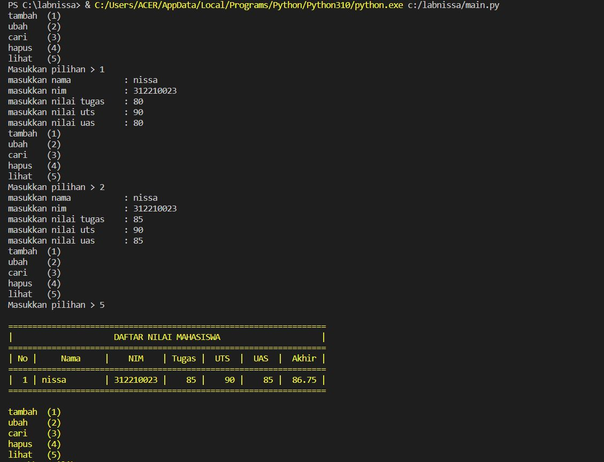
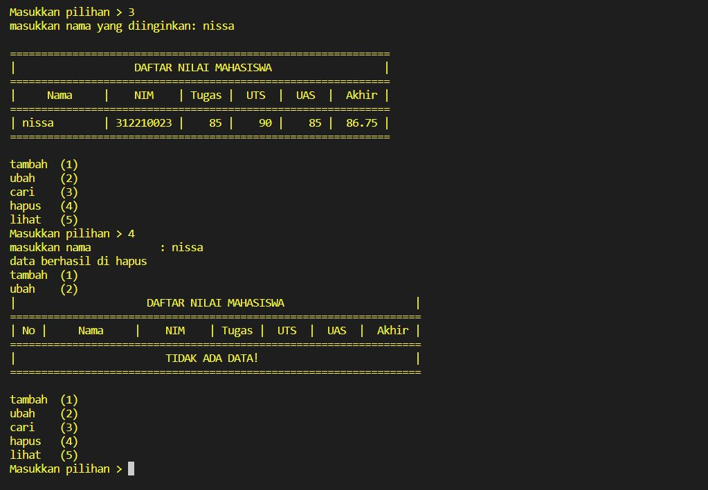

 # UAS
# UAS
 ## praktikum UAS
## Program Data Mahasiswa Python

## nama     : An-nisa fitriani
## NIM      : 312210023
## Kelas    : TI.22.C1

### DESKRIPSI
# main. py

*File ini berfungsi untuk mengimport modul - modul yang di buat.

    Contoh pengimportan modul:

    
    # mengimport class view dari modul view_nilai di dalam folder view
    from view.view_nilai import view
    # mengimport class daftar dari modul daftar_nilai di dalam folder daftar
    from model.daftar_nilai import daftar
    
# model/_data.py

*Modul ini berfungsi sebagai penampung data dari modul - modul yang di buat

# model/ _init.py & view/ _init.py

*Modul ini di isi dengan method Init dan berfungsi sebagai method yang pertama kali di jalankan atau di proses sebelum method-method yang lainnya dan method _init() berguna untuk melakukan inisialisasi pembuatan object dari class.

    contoh pembuatan method _init()

def _init_(self, nama, nim):
    self._nama = nama
    self._alamat = nim

# view/input_nilai.py

*odul ini di isi class inputdata dan di isi dengan method inputan - inputan untuk modul - modul lainnya dan di inisialisasi dari method __init.

    contoh pembuatan input:

    self._nama = input('Masukan Nama : ')
    self._nim = input('Masukan Nim : ')

# view/input_nilai.py

Modul ini di berisi method cetak data mengimport dari modul model/_data.py

contoh import dan cetak data:

# mengimport class data dari modul _data di dalam folder model
from model._data import data
# mencetak hasil inputan yang di tampung di class data
print("| {0:15}   | {1:9} |".format(self.nama, self

# model/daftar_nilai.py

*Modul ini di isi dengan class yang berisi method - method :

 -tambah_data() yang mengimport modul inputan dari input_nilai dan di masukan ke modul data

 -ubah_data() yang mengimport modul inputan dari input_nilai dan menggunakan pengkondisian jika inputan di dalam modul data lalu memasukan  inputan baru dari modul input_nilai ke dalam modul data

 -hapus_data() yang mengimport modul inputan dari input_nilai dan menggunakan pengkondisian jika inputan di dalam modul data lalu menghapus data di dalam modul data yang sesuai dengan modul inputan dari input_nilai.

 -cari_data() yang mengimport modul inputan dari input_nilai dan mencetak data dari modul view_nilai yang sesuai dengan inputan dari modul input_nilai contoh program:

def tambah_data(self):
    # modul input_nilai
    # memasukan input_nilai ke modul data
def ubah_data(self):
    # modul input_nilai
    # pengkondisian jika modul input_nilai di dalam modul data
    # memasukan modul input_nilai baru ke dalam modul data
def hapus_data(self):
    # modul input_nilai
    # pengkondisian jika modul input_nilai di dalam modul data
    # hapus data yang sesuai modul input_nilai
def cari_data(self):
    # modul input_nilai
    # pengkondisian jika modul input_nilai di dalam modul data
    # modul view

## OUTPUT

## LINK YOUTUBE
penjelasan lebih lengkap bisa liahat di vidio Youtube
https://youtu.be/FjAVJ_6i8UA

 
